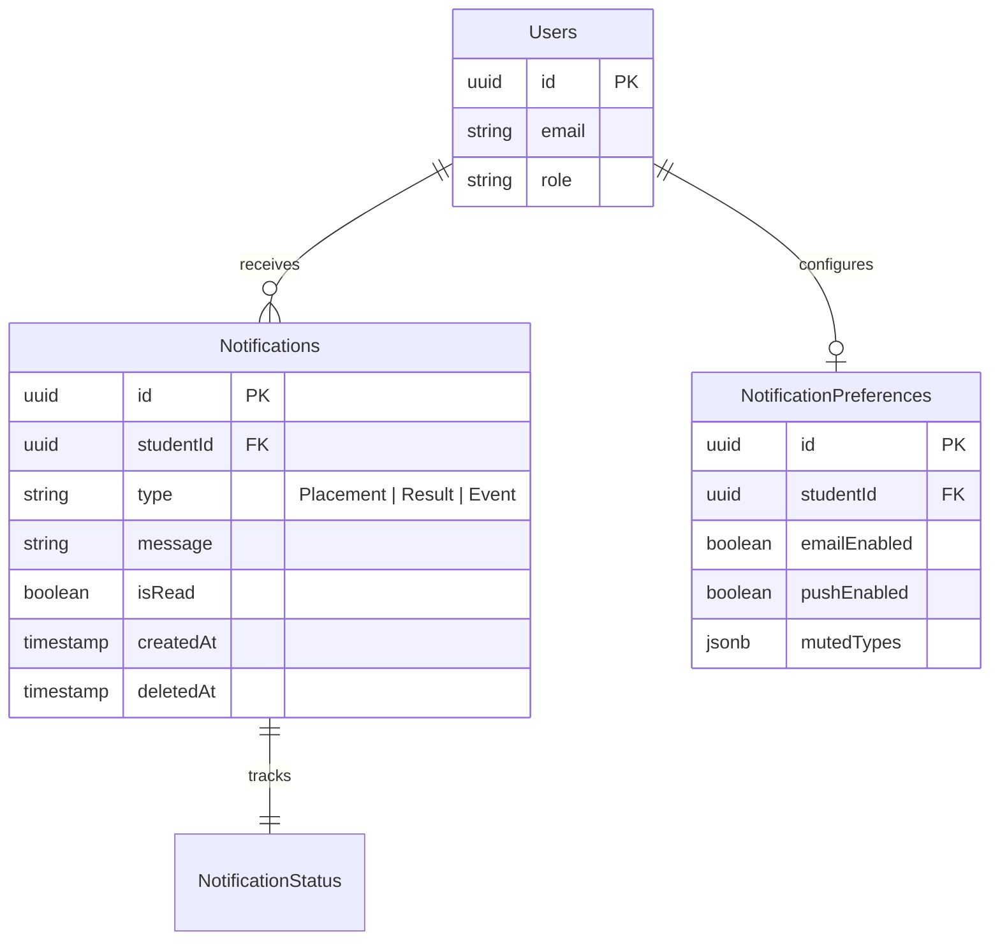
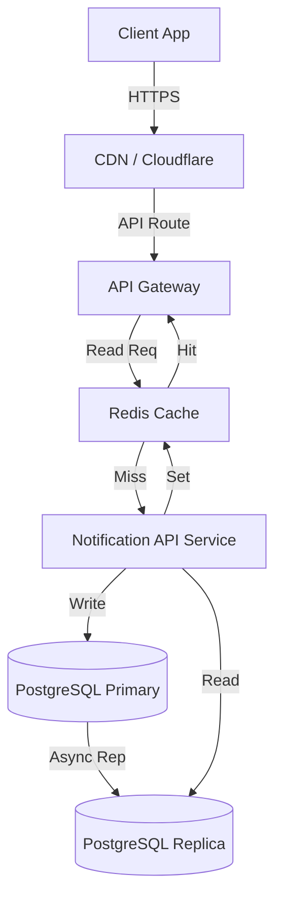
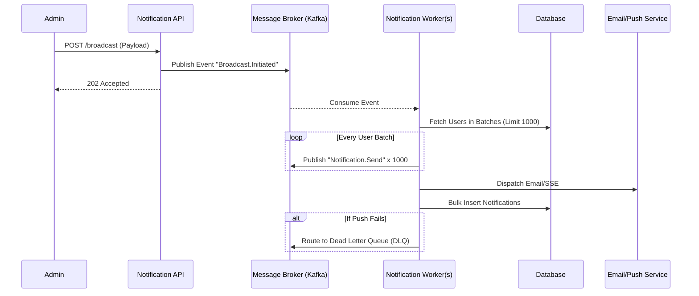

# Notification System Design Document

## STAGE 1: REST API DESIGN

### Microservice Endpoints Overview

| API Action | Method | Endpoint |
| :--- | :--- | :--- |
| **Create Notification** | `POST` | `/api/v1/notifications` |
| **Notify Individual** | `POST` | `/api/v1/notifications/send` |
| **Notify All** | `POST` | `/api/v1/notifications/broadcast` |
| **Get Notifications** | `GET` | `/api/v1/notifications` |
| **Get Unread** | `GET` | `/api/v1/notifications?status=unread` |
| **Mark Read** | `PATCH` | `/api/v1/notifications/{id}/read` |
| **Mark All Read** | `PATCH` | `/api/v1/notifications/read-all` |
| **Delete Notification** | `DELETE` | `/api/v1/notifications/{id}` |
| **Notification Count** | `GET` | `/api/v1/notifications/count?status=unread` |
| **Notification Preferences** | `GET` | `/api/v1/notifications/preferences` |
| **Update Preferences** | `PUT` | `/api/v1/notifications/preferences` |

### Endpoint Specifications

#### 1. Notify Individual
* **Method & URL**: `POST /api/v1/notifications/send`
* **Headers**: `Authorization: Bearer <JWT>`, `Content-Type: application/json`
* **Request JSON**:
  ```json
  {
    "studentId": "uuid",
    "type": "Placement",
    "message": "You have been shortlisted for Acme Corp."
  }
  ```
* **Response JSON**:
  ```json
  {
    "status": "success",
    "notificationId": "uuid",
    "createdAt": "2024-05-20T10:00:00Z"
  }
  ```
* **Status Codes**: `201 Created`, `400 Bad Request`, `401 Unauthorized`

*(All other endpoints follow standard REST resource conventions matching the above schema pattern).*

### Authentication & Authorization
* **Authentication**: Stateless JWT (JSON Web Tokens) passed via `Authorization: Bearer` header. Services validate the signature via an API Gateway or local middleware.
* **Authorization**: Role-Based Access Control (RBAC). 
  * `Role: Admin`: Can call `Create Notification`, `Notify Individual`, and `Notify All`.
  * `Role: Student`: Can only access their own `Get Notifications`, `Mark Read`, etc. (Validated via `sub` claim in JWT).

### Notification Lifecycle
1. **Created**: Saved to DB with state `Unread`.
2. **Dispatched**: Pushed via WebSockets/SSE to active clients, or queued for Email/Push.
3. **Delivered**: Client acknowledges receipt.
4. **Read**: User clicks/views the notification.
5. **Archived/Deleted**: Soft-deleted after TTL (e.g., 30 days).

### Real-Time Notifications: Comparison & Recommendation

| Technology | Pros | Cons | Best For |
| :--- | :--- | :--- | :--- |
| **WebSocket** | Full full-duplex, low latency. | High overhead, complex scaling/load balancing. | Chat apps, multiplayer games. |
| **SSE (Server-Sent Events)** | Native HTTP, built-in reconnection, simple to scale, standard unidirectional flow. | Unidirectional (Server -> Client only). | Live feeds, notifications, tickers. |
| **Polling** | Simplest implementation, stateless. | High server load, wasted requests, latency delay. | Legacy systems with no real-time need. |

**Recommendation: SSE (Server-Sent Events)**
For notifications, the data flow is inherently asymmetric (Server pushes to Client). SSE operates over standard HTTP/1.1 or HTTP/2, making it drastically easier to route through load balancers and API Gateways compared to WebSockets. It supports automatic client reconnection natively, which is ideal for a notification feed.

---

## STAGE 2: DATABASE DESIGN

### Database Recommendation: **PostgreSQL (SQL)**
**Justification**: Notifications require robust querying, filtering (read/unread), indexing, and relational mapping to user preferences. PostgreSQL offers strict ACID compliance, powerful indexing (B-Tree/Partial indexes), and excellent JSONB support if we ever need dynamic notification payload structures. Furthermore, PostgreSQL's native Table Partitioning is perfect for archiving older notifications.

### Schema & ER Diagram



### Indexing Strategy
* **Primary Keys**: `id` (UUIDv7 for sortable primary keys to prevent B-Tree fragmentation).
* **Foreign Keys**: `studentId` on `Notifications`.
* **Composite Index**: `(studentId, isRead, createdAt DESC)` for ultra-fast inbox querying.

### Data Management Strategy
* **Data Growth & Partitioning**: Partition the `Notifications` table by range on `createdAt` (e.g., monthly partitions: `notifications_2024_05`).
* **Archiving & TTL**: Run a cron job to detach partitions older than 6 months and move them to cold storage (e.g., AWS S3).
* **Soft Delete**: Use a `deletedAt` column. Queries will include `WHERE deletedAt IS NULL`.

### SQL Queries

**Create notification**
```sql
INSERT INTO notifications (id, studentId, type, message, isRead, createdAt) 
VALUES (gen_random_uuid(), 'student-uuid', 'Result', 'Passed!', false, NOW());
```

**Get unread notifications**
```sql
SELECT id, type, message, createdAt FROM notifications 
WHERE studentId = 'student-uuid' AND isRead = false AND deletedAt IS NULL 
ORDER BY createdAt DESC LIMIT 20;
```

**Mark read**
```sql
UPDATE notifications SET isRead = true 
WHERE id = 'notif-uuid' AND studentId = 'student-uuid';
```

**Unread count**
```sql
SELECT COUNT(id) FROM notifications 
WHERE studentId = 'student-uuid' AND isRead = false AND deletedAt IS NULL;
```

**Latest notifications**
```sql
SELECT id, type, message, isRead, createdAt FROM notifications 
WHERE studentId = 'student-uuid' AND deletedAt IS NULL 
ORDER BY createdAt DESC LIMIT 10;
```

---

## STAGE 3: QUERY OPTIMIZATION

### The Problematic Query
```sql
SELECT * FROM notifications 
WHERE studentId = ? AND isRead = false 
ORDER BY createdAt DESC;
```

**Why it is slow:**
1. **Missing Indexes**: Without an index on `studentId`, the database performs a Full Table Scan ($O(N)$ complexity) searching millions of rows.
2. **`SELECT *`**: Pulling all columns wastes memory and network bandwidth.
3. **Sort Phase**: If `createdAt` isn't indexed, the DB must perform an in-memory sort (e.g., QuickSort) which is expensive.

**Execution Plan Analysis**: The DB engine relies on a `Seq Scan` followed by a `Sort` node. 

### Recommended Optimizations

**1. Composite Index:**
Create a composite index to satisfy the WHERE and ORDER BY clauses perfectly.
```sql
CREATE INDEX idx_notif_student_read_created ON notifications (studentId, isRead, createdAt DESC);
```

**2. Covering Index (Index-Only Scan):**
If we only need specific fields, we can INCLUDE them so the DB never has to hit the actual table heap.
```sql
CREATE INDEX idx_notif_covering ON notifications (studentId, isRead, createdAt DESC) INCLUDE (id, type, message);
```

**3. Cursor Pagination:**
Instead of `OFFSET`, which scans and discards rows, use Cursor Pagination (Keyset pagination).
```sql
SELECT id, type, message, createdAt FROM notifications 
WHERE studentId = ? AND isRead = false AND createdAt < ? 
ORDER BY createdAt DESC LIMIT 20;
```

**Why indexing every column is a bad idea:**
Every index increases write latency because every `INSERT`, `UPDATE`, and `DELETE` must update the B-Tree for every index. It also consumes significant disk space and RAM (cache bloat).

**Fetch Placement notifications within last 7 days:**
```sql
SELECT id, message, createdAt FROM notifications 
WHERE studentId = ? AND type = 'Placement' AND createdAt >= NOW() - INTERVAL '7 days' 
ORDER BY createdAt DESC;
```
*(Requires index: `(studentId, type, createdAt DESC)`)*

### Computational Complexity
* **Before**: $O(N)$ for full table scan + $O(K \log K)$ for sorting ($N$ = total rows, $K$ = matched rows).
* **After**: $O(\log N)$ to traverse the B-Tree to the first match + $O(L)$ to read the limit amount ($L$). Overall $O(\log N)$.

---

## STAGE 4: PERFORMANCE SCALING

Fetching notifications on every page load can DDoS the database.

### Scalable Architecture Design



### Key Strategies & Tradeoffs

1. **Redis Cache (Look-aside)**:
   * Store the first page of notifications for active users: `SET user:{id}:notifications "[...]"`
   * **Tradeoff**: Risk of stale data. Needs careful Cache Invalidation (e.g., evict cache on new notification).
2. **Read Replicas**:
   * Route `GET` requests to a read-only replica. 
   * **Tradeoff**: Eventual consistency (slight replication lag).
3. **API Gateway & Rate Limiting**:
   * Prevent abuse by limiting requests (e.g., 30 requests/minute per user).
4. **Compression**:
   * GZIP/Brotli compression at the Gateway drastically reduces payload sizes.
5. **SSE (Push) vs Polling**:
   * Instead of the client polling on page load, push the unread count via SSE only when it changes, and rely on the local client cache for rendering.

---

## STAGE 5: NOTIFY ALL

The current pseudocode loops through every student synchronously. If it fails halfway, we lose state, and it blocks the main thread.

### Event-Driven Redesign

We will decouple the trigger from the execution using an Event-Driven Architecture with **RabbitMQ** or **Kafka**.



### Core Concepts

* **Worker Queues**: Decouples heavy processing from the API. The API instantly returns `202 Accepted`.
* **Batch Processing**: Instead of inserting 1 by 1, use `INSERT INTO notifications (...) VALUES (...), (...), ...` in batches of 1000.
* **Idempotency**: Use a unique `idempotencyKey` in the message header. Before processing, the worker checks Redis `EXISTS job:{key}` to prevent duplicate sends if a network retry occurs.
* **Dead Letter Queue (DLQ) & Retries**: If the Email Service is down, the message goes back to the queue with exponential backoff. After 3 failures, it moves to the DLQ for manual inspection.
* **Throughput Estimate**: With 5 Node.js worker instances pulling from Kafka and bulk inserting, we can comfortably handle 10,000 notifications per second ($10k/sec$).

---

## STAGE 6: TOP N PRIORITY INBOX

*Please refer to the source code implementation of the `PriorityNotificationService` in the `notification-app-be/src` directory for the fully typed, working TypeScript solution utilizing a custom Min Heap logic.*
